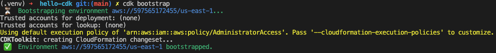
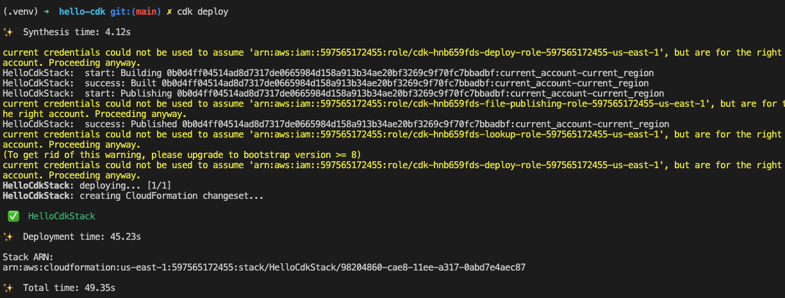
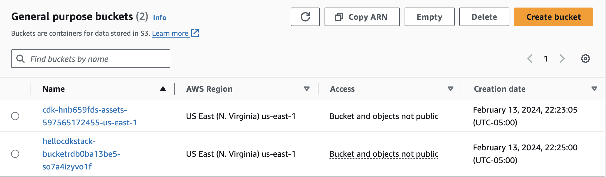

# S3 from CDK CLI

This repo follows the instructions provided [here](https://docs.aws.amazon.com/cdk/v2/guide/hello_world.html) to deploy a S3 bucket.

A new user in IAM was created with the following permissions:

```json

{
	"Version": "2012-10-17",
	"Statement": [
		{
			"Sid": "VisualEditor0",
			"Effect": "Allow",
			"Action": [
				"s3:ListAccessPointsForObjectLambda",
				"s3:GetAccessPoint",
				"s3:PutStorageLensConfiguration",
				"iam:CreateRole",
				"iam:AttachRolePolicy",
				"iam:PutRolePolicy",
				"cloudformation:CreateChangeSet",
				"s3:ListStorageLensGroups",
				"ssm:GetParameter",
				"ecr:DeleteRepository",
				"iam:PassRole",
				"ssm:DeleteParameter",
				"iam:DetachRolePolicy",
				"cloudformation:DescribeStackEvents",
				"iam:DeleteRolePolicy",
				"s3:ListAccessGrantsInstances",
				"ecr:DescribeRepositories",
				"cloudformation:DescribeChangeSet",
				"cloudformation:ExecuteChangeSet",
				"iam:GetRole",
				"ecr:PutLifecyclePolicy",
				"s3:PutAccountPublicAccessBlock",
				"s3:ListAccessPoints",
				"ecr:CreateRepository",
				"s3:ListJobs",
				"s3:CreateStorageLensGroup",
				"iam:DeleteRole",
				"ssm:GetParameters",
				"s3:ListMultiRegionAccessPoints",
				"cloudformation:DescribeStacks",
				"ssm:PutParameter",
				"s3:ListStorageLensConfigurations",
				"s3:GetAccountPublicAccessBlock",
				"s3:ListAllMyBuckets",
				"cloudformation:GetTemplate",
				"cloudformation:DeleteStack",
				"ecr:SetRepositoryPolicy",
				"s3:PutAccessPointPublicAccessBlock",
				"s3:CreateJob"
			],
			"Resource": "*"
		},
		{
			"Sid": "VisualEditor1",
			"Effect": "Allow",
			"Action": [
				"s3:PutEncryptionConfiguration",
				"s3:PutBucketPublicAccessBlock",
				"s3:*",
				"s3:PutBucketPolicy",
				"s3:CreateBucket",
				"s3:DeleteBucketPolicy",
				"s3:DeleteBucket",
				"s3:PutBucketVersioning"
			],
			"Resource": "arn:aws:s3:::*"
		}
	]
}
```

Then the code was modified to have versioning and encryption handled by S3:

```python
        bucket = s3.Bucket(
            self, "BucketRDB", versioned=True, encryption=s3.BucketEncryption.S3_MANAGED
        )
```
Next the code was bootstraped:



and deployed:



To finally have the Bucket on S3:

